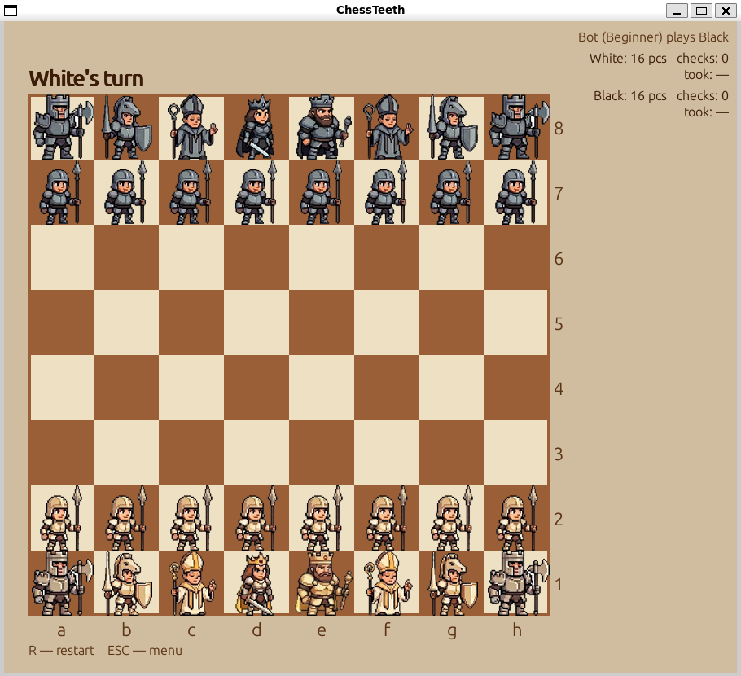

# ChessTeeth

A desktop chess game I made for my 9-year-old daughter who just got into chess and had one specific request: the pieces should **bare their teeth** when they capture.

Two goals, one project — she gets a game made just for her, and a codebase to start learning Python with.



---

## What it does

- Full two-player chess with legal-move highlighting, check detection, and all draw conditions
- **CHOMP!** — capturing pieces flash a toothed mouth and the board shouts CHOMP!
- Play against a bot at five difficulty levels — from pure random (Beginner) to ELO-rated opponents up to 2400
- Board flips automatically when you play as Black so your pieces are always at the bottom
- Pawn promotion lets you pick the piece you want (Queen / Rook / Bishop / Knight)
- Capture rings highlight enemy pieces you can take so you never miss a free piece
- Live stats panel shows pieces remaining, material captured, and checks given per side
- Pixel-art chessmen designed with Google Gemini — each piece is a character with a face, armor, and weapons
- Resizable window — drag it as big as you like, the board scales with it
- Parchment color theme

---

## Requirements

| Tool | Install |
|------|---------|
| Python 3.12+ | https://www.python.org/downloads/ |
| uv | `curl -LsSf https://astral.sh/uv/install.sh \| sh` (Mac/Linux) · `winget install astral-sh.uv` (Windows) |
| Stockfish *(optional, for bot)* | `sudo apt install stockfish` (Linux) · `brew install stockfish` (Mac) · https://stockfishchess.org/download/ (Windows) |

---

## Run

```bash
git clone https://github.com/nli276/chessteeth.git
cd chessteeth
uv run chessteeth
```

`uv` handles the virtual environment and installs `pygame`, `python-chess`, and `Pillow` automatically on first run.

---

## Controls

| Action | Effect |
|--------|--------|
| Click a piece | Select (legal moves shown as dots) |
| Click a dot or ring | Move there (ring = capturable enemy) |
| Click a promotion tile | Choose promoted piece after pawn reaches last rank |
| `Q` / `R` / `B` / `N` | Keyboard shortcut for promotion choice |
| `R` | Back to menu |
| `ESC` | Back to menu |

---

## Project layout

```
chessteeth/
├── source/          # source screenshots and reference images
├── game/            # Python package
│   ├── main.py      # window, menu, game loop
│   ├── state.py     # game state (wraps python-chess)
│   ├── board.py     # board rendering, scales with window size
│   ├── pieces.py    # piece drawing + chomp animation
│   ├── sprites.py   # sprite loading and caching
│   ├── themes.py    # color theme
│   ├── bot.py       # Stockfish wrapper (background thread)
│   └── assets/      # generated 128×128 PNGs (auto-created)
├── pyproject.toml
└── uv.lock
```

---

## Bot difficulty

| Level | How it plays |
|-------|-------------|
| Beginner | Picks a random legal move — gives away pieces freely, no plan at all |
| Easy | Stockfish depth 1 + maximum error injection — equivalent to Lichess bot Level 1 |
| Medium | ELO 1350 — protects pieces, has a rough plan, misses combinations |
| Hard | ELO 1800 — plays solidly, punishes tactical mistakes |
| Expert | ELO 2400 — near-master strength |

**Why ELO?** Chess ratings describe consistent playing strength on a single scale. ELO 1350 makes the kind of mistakes a 1350-rated human makes — genuine oversights, not random blunders — producing a smooth ramp rather than sudden difficulty spikes. Stockfish's ELO floor is ~1320, so Beginner and Easy use depth limits instead.

Stockfish is required for Easy and above. Without it, only Beginner (random) is available.

---

## Art

The pixel-art chessmen were designed using Google Gemini as a creative tool. All artwork was prompted, refined, and adapted by the author — four prompt iterations to nail consistent weapon hands, color palettes, and the chomp expression. See [source/chessteeth_image_prompt.md](source/chessteeth_image_prompt.md) for the full prompt log.

---

## License

MIT — see [LICENSE](LICENSE).
